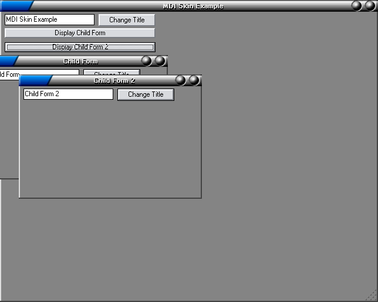



## Apply A Skin To An MDI and Child Form\(s\)

### Description

Example of how to apply a skin to both the MDI Parent & Child Forms. Please Vote!!!
 
### More Info
 

             |
---                |---
**Submitted On**   |2003-11-12 13:54:08
**By**             |[KRYO\_11](https://github.com/Planet-Source-Code/PSCIndex/blob/master/ByAuthor/kryo-11.md)
**Level**          |Advanced
**User Rating**    |4.1 (37 globes from 9 users)
**Compatibility**  |VB 5\.0, VB 6\.0
**Category**       |[Graphics](https://github.com/Planet-Source-Code/PSCIndex/blob/master/ByCategory/graphics__1-46.md)
**World**          |[Visual Basic](https://github.com/Planet-Source-Code/PSCIndex/blob/master/ByWorld/visual-basic.md)
**Archive File**   |[Apply\_A\_Sk16712311122003\.zip](https://github.com/Planet-Source-Code/kryo-11-apply-a-skin-to-an-mdi-and-child-form-s__1-49860/archive/master.zip)

